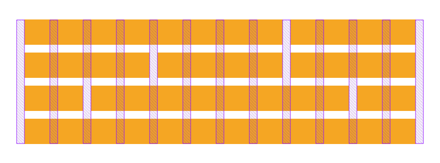

<span align="center">



# Simple Columns - 12-column layout framework

[](https://opensource.org/licenses/mit-license.php)


</span>

A simple 12-column framework utilizing CSS grid, built with a focus on keeping the syntax simple and readable. 

* Simple syntax powered by responsive modifiers
* Pure CSS, no precomiling or other tools needed.
* Fully responsive
* Infinite nesting

## Installation

[Download simple.css](https://raw.githubusercontent.com/arronhunt/simple-columns/master/src/simple.css)

```html
<link rel="stylesheet" type="text/css" href="css/simple.css" />
```

## Usage 

**Container**

Class | Usage | Accepts modifiers
----|----|----
`.col-row` | Container for your columns, handles the grid | No
`.col-fluid` | Used in addition to `.col-row`, this tells the row not to break at breakpoints | No

**Columns**

Class | Usage | Accepts modifiers
----|----|----
`.col-{n}` | Spans your column across `n` number of columns. Max of 12 | Yes
`.col-top` | Aligns the column to the top of the row | Yes
`.col-center` | Aligns the column to the center of the row | Yes
`.col-bottom` | Aligns the column to the bottom of the row | Yes 
`.col-stretch` | Stretches a column vertically inside its row | Yes 

### Column spans

Elements can span multipl columns using the `.col-{n}` class

```html
<div class='col-row'>
  <div class='col-9'>Nine columns</div>
  <div class='col-3'>Three columns</div>
  <div class='col-3'>Three columns</div>
</div>
```

### Responsive Modifiers

Column sizes and placement can update based on viewport size using size modifiers. The following modifiers can be appanded to any `.col-` class to change based on browser size.

Mobile | Tablet | Desktop | Desktop HD
----|----|----|----
`xs=` | `sm=` | `md=` | `lg=`
`30em` | `45em` | `60em` | `75em`

**Examples**

Adapt column span:
```html
<div class='col-row'>
  <div class='lg=col-6 md=col-4 sm=col-2'></div>
  <div class='lg=col-6 md=col-8 sm=col-10'></div>
</div>
```

Adapt placement:
```html
<div class='col-row'>
  <div class='col-4 md=col-bottom sm=col-bottom'></div>
  <div class='col-4 md=col-center sm=col-bottom'></div>
  <div class='col-4 md=col-top    sm=col-top'></div>
</div>
```
